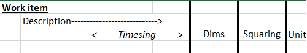

# Dimension Sheet
The standard method of measurement for taking off elements of work is the dimension sheet.  The layout is typically a series of columns that provide a description, the dimensions for the work element, a multiplication for items with the same dimensions (timesing column), and a total (squaring column).

## The Measurement Section
The first column in each section can be used to describe the work item (e.g., excavation, backfill, concrete), the second column allows for a more detailed description of the location or any other relevant information.

This form uses three columns for expanded multiplication (e.g. *2 buildings x 2 members x 2 sides of given dimension*), dims are entered vertically in the dim column and 'squared out' in the next column.  The final column allows for typing the units represented where necessary.

## The Problem
When calculating totals in the squaring column the user must remember to multiply the correct row in the timesing columns by the appropriate number of cells in the sqauaring column (i.e., *2 for square metres, 3 for cubic metres*).

Occassional mistakes could be made, particularly where different formulas were used for dims without multipliers for quick entry.  Formulas may be copied and pasted without accounting for the differences, or occassionally assigning to the wrong type (e.g., *a 2-dimension formula to a 3-dimension item*).

## The Solution
The process was simplified to speed entry while standardising formulas for each type.  New formulas have been created (**m**, **sm**, and **cm**) for each type of item (1, 2, and 3-dimension respectively) which will automatically calculate the total.  This ensures no omissions are made and allows for easy checking if formulas are assigned to the correct type of calculation.

The actual vb code can be found [here](SMcmd.bas)
